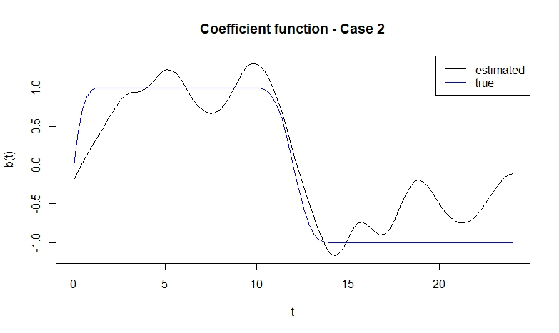
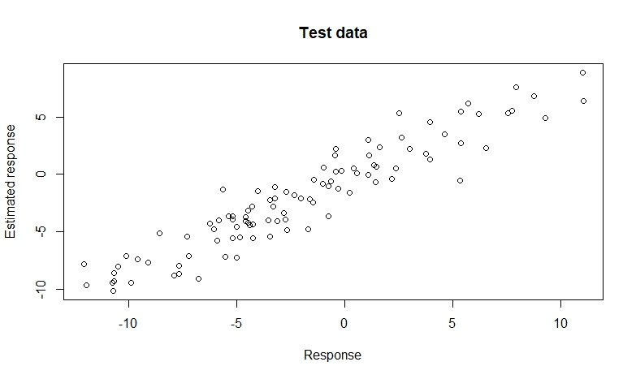

# P3LS

`P3LS` is an R-package that provides an implementation of the point process partial least squares. The algorithm is based on the paper [P3LS: Point Process Partial Least Squares](https://arxiv.org/abs/2412.11267) by Jamshid Namdari, Robert Krafty, and Amita Manatunga. 

## Installation

```r
library(devtools)
library(remotes)
remotes::install_github("jamnamdari/P3LS")
```

## Datasets

The R package contains two datasets `D` and `D_sim`. The dataset `D_sim` contains a simulated dataset and `D` contains the real dataset used in the motivating application. 

### Simulated data

`D_sim` is a list containing the following objects.

+ `PPP_obs`: a list of 100 realizations of the point process described in the paper used as the training data.
+ `PPP_test`: a list of 100 realizations of the point process described in the paper used as the testing data.  
+ `y_obs`: a vector of length 100 of the training responses that were generated according to model (1) in the paper.
+ `y_obs`: a vector of length 100 of the testing responses that were generated according to model (1) in the paper.
+ `b`: the coefficient function in Case2.
+ `X_list_all`: the log intensities of the training and testing point processes.

### Real data

`D` contains renogram information of the left kidnies of the patients in the study. It is a dataframe containing the following components.

## Using the P3LS function
The `P3LS` function accepts implements the P3LS algorithem. Arguments of the function are as follows.

+ `PPP_obs`: A list containing vectors of tarining point process observed times.
+ `PPP_test`: A list containing vectors of testing point process observed times.
+ `y`: Training response values.
+ `y_test`: Testing response values.
+ `h`: Smoothing parameter in covariance function estimation.
+ `p`: Number of PLS basis used.
+ `q`: Number of basis functions used in log-intensity estimation.
+ `T`: Number of bins used for numerical integration.
+ `lbd`: Lower bound of the time interval on which the point process is observed.
+ `ubd`: Upper bound of the time interval on which the point process is observed.
+ `nb`: Number of bins in log-intensity estimation.

The function returns a list with the following elements.

### Example

#### Model fitting

```r
Results_PP <- P3LS(D_sim$PPP_obs, D_sim$PPP_test, D_sim$y_obs, D_sim$y_test, h=2, p=10, q=15, T=100, lbd=0, ubd=24, nb = 100)
```

#### Plots

##### Plot of the estimated coefficient function
```r
plot(seq(0,24,length.out=100), Results_PP$b_hat[,2], type='l', xlab = "t", ylab = "b(t)", main = "Coefficient function - Case 2")
points(seq(0,24,length.out=100), b, type="l", col="blue")
legend("topright", legend = c("estimated", "true"), lty=c(1,1), col = c("black", "blue"))
```



##### Plot of the predicted vs the response in the test set

```r
plot(y_test, Results_PP$y_hat_test[,2], xlab="Response", ylab = "Estimated response", main = "Test data")

```



## Data analysis

### Model fitting

```r
Results_Left <- P3LS:::P3LS(PPP_obs, PPP_test, y, y_test, h=2, p=10, q=10, T=100, lbd=0, ubd=45, nb = 100)
```

### Plots

```r
# Plotof the estimated coefficient function
plot(Results_Left$b_hat[,2], lty=1, main = "Coefficient Function - Left Kidney", type="l", ylab="", xlab = "time index", ylim=c(-.02,.025))

# Plot of the first PLS basis function
plot(Results_Left$basis[,1], xlab=", ylab=", main="Frist PLS basis function - Left Kidnay")

# Plot of the second PLS basis function
plot(Results_Left$basis[,2], xlab=", ylab=", main="Second PLS basis function - Left Kidnay")

# Plot of the square root of MSPE for p=1,...,10
plot(1:10, Results_Left$rMSPE_test, xlab="Number of PLS basis functions - Left Kidney", ylab="rMSPE", main="Square root of MSPE")

```

